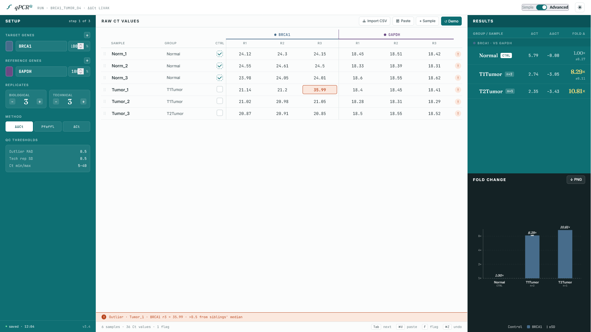

# qPCR* <p align="center">  
A browser-based, qPCR fold change calculator aimed at students and researchers alike. No installation. No server. No data leaves your machine.
Built to replace messy Excel workflows that accumulate errors and produce invalid results.

> ⚠️ **Beta version.** This tool is under active development. Results should be independently verified before use in publications. Please report bugs via [GitHub Issues](https://github.com/ck-bio/qpcr/issues).

---

## Live Tool

**[ck-bio.github.io/qpcr](https://ck-bio.github.io/qpcr)**

Or download `index.html` and open it directly in your browser.

---

## Screenshots

New test UI:


---

## Features

- **Gene search** via [MyGene.info](https://mygene.info) API — type a gene symbol and autocomplete from a curated database
- **Multiple reference genes** — normalised via geometric mean of Ct values
- **Per-gene colour pickers** — colour propagates to chart bars and table accents
- **Bar chart** with asymmetric error bars
- **Expandable results table** — group-level summary with per-sample drill-down
- **CSV export** — UTF-8 BOM, filename format `YYYYMMDD_Target_Reference.csv`
- **PNG chart export**
- **30-step undo/redo** stack
- **Excel-style keyboard navigation** — arrow keys, Tab, F to flag, Ctrl+Z/Y
- **Dark/light theme**
- **localStorage persistence** — your data survives a browser refresh
- **Multiple locale support** — comma-to-period coercion for Ct inputs
- **Efficiency correction** — Pfaffl-style per-channel correction; efficiency range 1.0–2.0
- **Outlier flagging** — IQR-based detection with cell tinting and footer summary

---

## Methods

Fold changes are calculated using the ΔΔCt method (Livak & Schmittgen, 2001) in Standard mode, or the Pfaffl efficiency-corrected method (Pfaffl, 2001) in Advanced mode.

**Standard mode (ΔΔCt):**

```
ΔCt = Ct(target) − Ct(reference)
ΔΔCt = ΔCt(sample) − ΔCt(control)
Fold change = 2^(−ΔΔCt)
```

**Advanced mode (Pfaffl):**

```
Fold change = E_target^(−ΔCt_target) / E_ref^(−ΔCt_ref)
```

Where E is amplification efficiency (1.0–2.0; E = 2.0 corresponds to 100% efficiency).

Group-level fold changes are computed from the **mean ΔCt** of replicates, not from the mean of individual fold change values. Error bars are asymmetric and computed in ΔΔCt space before exponentiation.

### References

- Livak KJ, Schmittgen TD (2001). Analysis of relative gene expression data using real-time quantitative PCR and the 2^(−ΔΔCT) method. *Methods*, 25(4), 402–408. https://doi.org/10.1006/meth.2001.1262
- Pfaffl MW (2001). A new mathematical model for relative quantification in real-time RT-PCR. *Nucleic Acids Research*, 29(9), e45. https://doi.org/10.1093/nar/29.9.e45
- Bustin SA et al. (2009). The MIQE guidelines: minimum information for publication of quantitative real-time PCR experiments. *Clinical Chemistry*, 55(4), 611–622. https://doi.org/10.1373/clinchem.2008.112797

---

## Usage Notes
- Amplification efficiency values must be determined experimentally (e.g., from a standard curve) before using Advanced mode
- The tool does not connect to any server - all computation is local, no data is uploaded anywhere

---

## Planned Features (V2 / V3)

- UI/UX overhaul
- Multi-gene support in Advanced Mode
- CSV data parse
- Reference gene stability scoring (geNorm / NormFinder)
- Sample setup modal (stamp plate layout before data entry)
- Snapshot / export state feature
- Statistical testing
---

## Contributing

Bug reports and feature requests welcome via [GitHub Issues](https://github.com/username/qpcr/issues).

This is a single-file vanilla HTML/CSS/JS project — no build tools, no framework, no npm. Pull requests should maintain that constraint.
